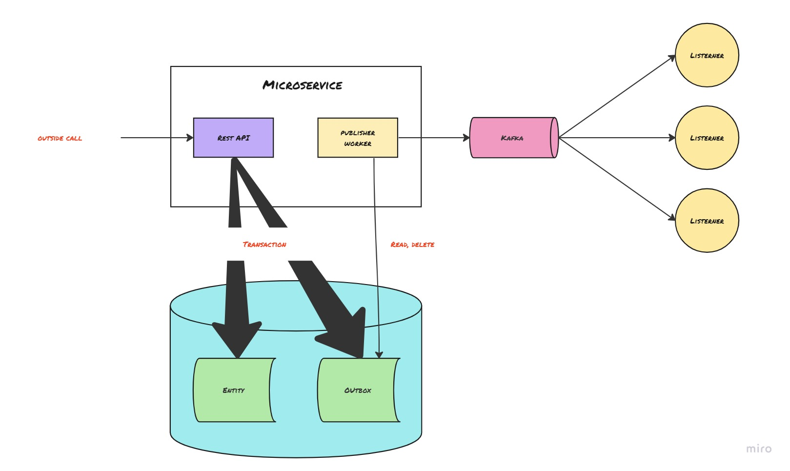
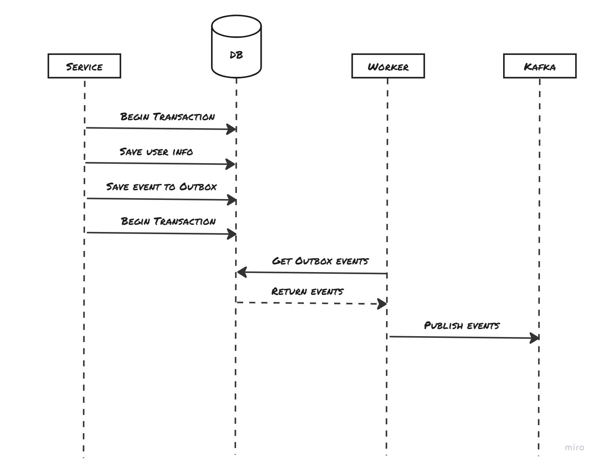

# PatternOutbox 

Le pattern Outbox est une façon de s'assurer que les modifications apportées à une base de données sont finalement consistantes avec les systèmes externes, même en cas de défaillances. L'idée de base est d'écrire les modifications dans la base de données et dans la Outbox (c'est-à-dire une table spéciale dans la base de données) dans une seule transaction, puis d'avoir un worker indépendant qui lit la outbox et publie les modifications aux systèmes externes.

Avec Kafka, vous pouvez mettre en place le pattern Outbox de la façon suivante :

- Lorsqu'une modification est apportée à la base de données, insérez un nouvel enregistrement dans la table de la outbox avec les détails de la modification.

- Un background worker écrit en C# (ou autre langage) peut lire la table de la outbox et envoyer les modifications aux systèmes externes en produisant des messages sur un topic Kafka.

- Les systèmes externes peuvent ensuite consommer les messages depuis le topic, appliquer les modifications et mettre à jour leur propre état.

- Une fois qu'un message est consommé par le système externe, vous pouvez marquer ce message comme consommé dans la outbox de sorte qu'il ne soit plus produit et archivé.



L'utilisation de Kafka pour la communication entre la outbox et les systèmes externes présente l'avantage d'être hautement évolutif, tolérant aux pannes et de fournir de bonnes performances.

## Quand l'utiliser ?

Lorsque vous avez une application qui modifie des données dans une base de données, et que ces modifications doivent être reflétées dans un ou plusieurs systèmes externes.

Par exemple, imaginez une application de multiservice proposant un système de fidélité. Un client souhait effectuer un demande de modification d'information personnel.



Avec la pattern Outbox, lorsque l'application modifie les informations d'un client dans sa base de données, elle insère également un enregistrement dans la outbox contenant les détails de la modification. Ensuite, un processus séparé (worker) lit les enregistrements de la outbox et envoie les modifications aux systèmes externes via Kafka. Le système de gestion des différents service peuvent alors consommer les messages de Kafka et mettre à jour leurs propre état pour refléter les modifications apportées.

L'entité outbox sera alors constitué de la façons suivante : 

```csharp
 [Table("Outbox")]
    public class Outbox
    {
        [Key] public long Id { get; set; }
        public string AggregateType { get; set; }
        public string AggregateId { get; set; }
        public string EventType { get; set; }
        public JsonNode Payload { get; set; }
    }
```


## Différer une demande : retour vers le futur

Dans certain cas fonctionnel vous pouvez avoir besoin de différer votre traitement. 

Imaginez que l'application possède une fonctionnalité qui permet aux utilisateurs de soumettre des demandes, telles que des demandes de résiliation, qui doit être appliquée à une date future spécifique.

Le pattern Outbox peut être combiné avec le pattern d'état pour gérer une date d'effet sur une demande de manière efficace.

A la réception de la demande, l'application va stocker les informations demande dans la base de données, y compris la date à laquelle la demande doit être appliquée.

En utilisant le pattern Outbox, l'application peut différer le traitement des demandes jusqu'à ce que la date d'effet soit atteinte.

On va donc compléter l'entité outbox avec un champs **ShecduleDeleveryDate** correspondant a cette date d'effet.

```c#
 [Table("Outbox")]
    public class Outbox
    {
        [Key] public long Id { get; set; }
        public string AggregateType { get; set; }
        public string AggregateId { get; set; }
        public string EventType { get; set; }
        public JsonNode Payload { get; set; }
        public DateTime  ShecduleDeleveryDate { get; set; }
    }
```

Le worker peut alors récupérer les entrées de la outbox seulement les messages dont la **ScheduleDeleveryDate** est atteinte ou dépassé.

Cela permet de gérer les demandes avec une date d'effet de manière efficace, en évitant le traitement inutile des demandes avant que la date d'effet ne soit atteinte. 
En implémentant le pattern d'état sur la demande on pourras fonctionner en deux étapes :
   - A la réception la demande est dans un état initial, envoyer un message dans la outbox avec un ScheduleDeleveryDate dans le futur. 
   - Ce message sera consommé par le service pour exécuter la demande à la date d'effet pour changer l'état de la demande et envoyer le message correspondant à ce nouvel état à destination des autres services.

Ainsi tant que la date d'effet n'est pas atteinte la demande pourra être modifié en changeant son état vers l'état annulé par exemple si le client souhait revenir sur ça demande de résiliation.


## Conclusion

Il existe de nombreux cas d'utilisation pour la pattern Outbox dans différents contextes.

L'idée est que la pattern Outbox offre une méthode pour gérer la synchronisation des données entre plusieurs systèmes en utilisant une technique de messages asynchrones, qui est fiable et évolutive.